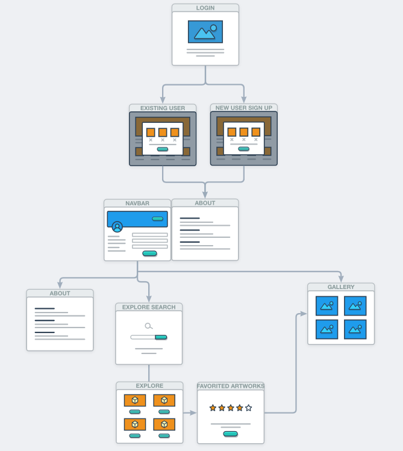
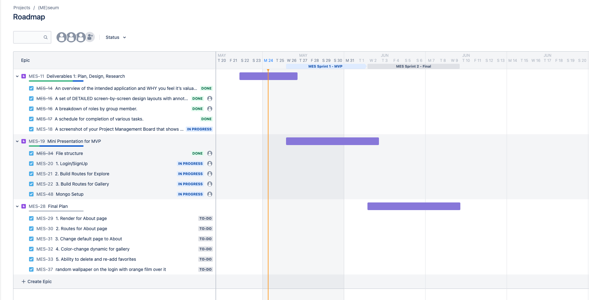
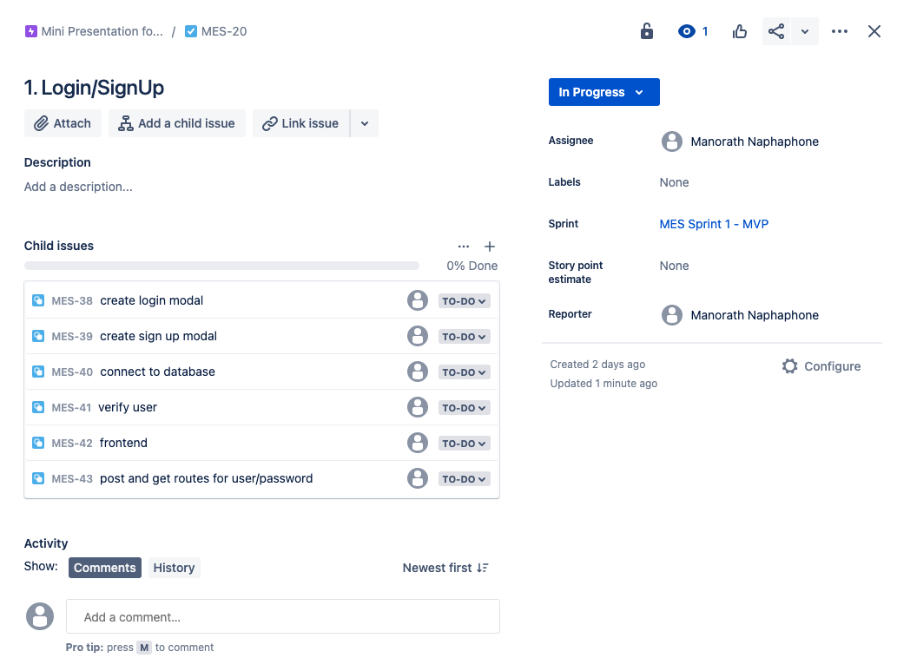
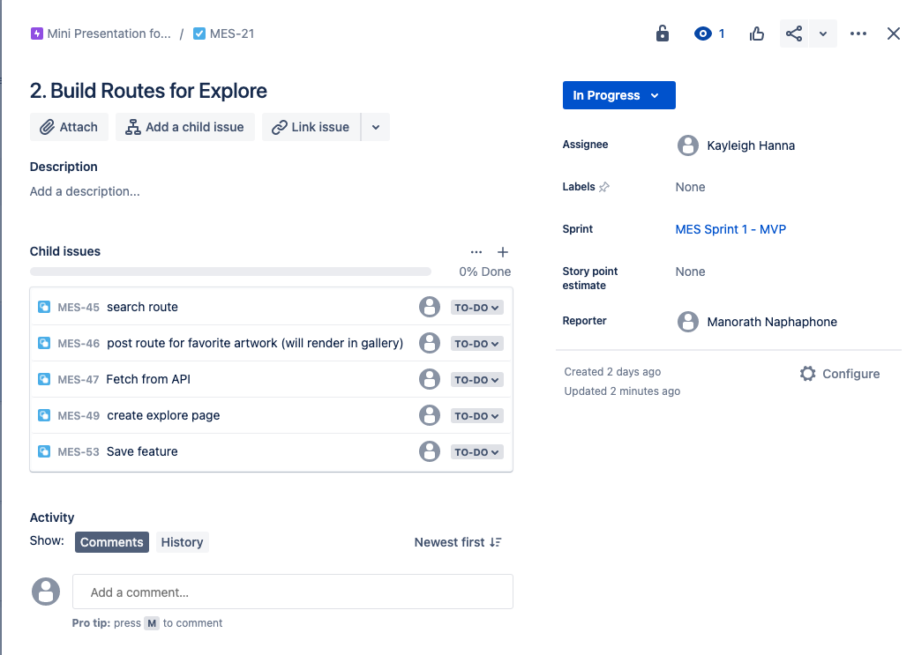
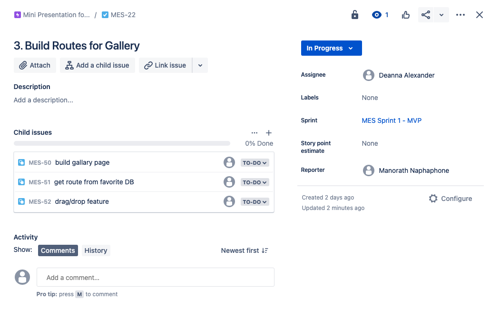
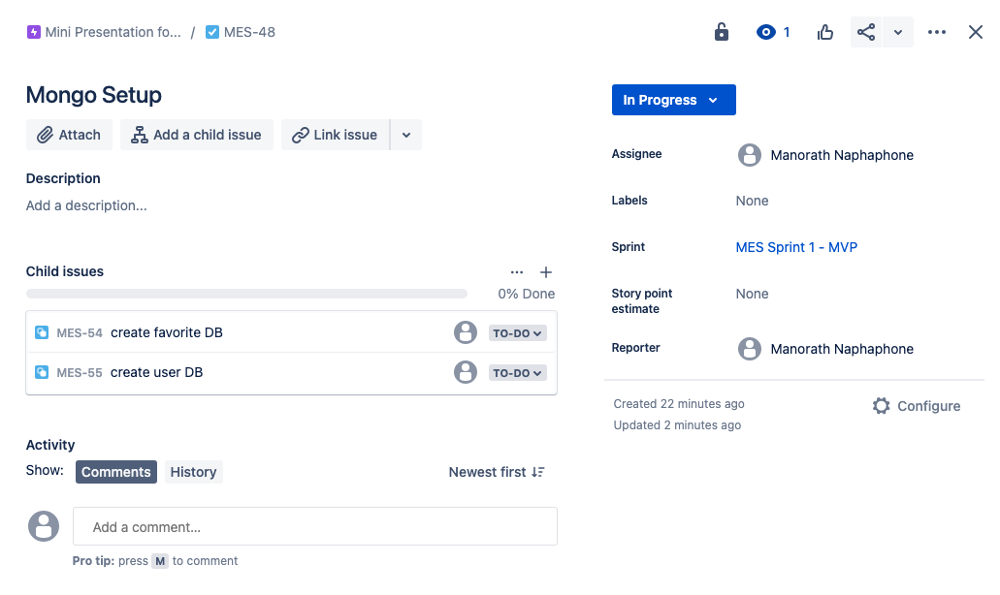

# **(ME)seum** - [](https://opensource.org/licenses/MIT)

A digital art browser, where you can drag and drop to create your own art gallery and learn about art.

## Table of Contents
  - [Description](#Description)
  - [User-Story](#User-Story)
  - [Acceptance-Criteria](#Acceptance-Criteria)
  - [Original-Design](#Original-Design)
  - [Breakdown-of-Roles](#Breakdown-of-Roles)
  - [Schedule](#Schedule)
  - [Finished-Demo](#Finished-Demo)
  - [License](#License)
  - [Contact](#Contact)

## Description  
```
(ME)seum is a digital art browser, where you can drag and drop to create your own art gallery and learn about art.

This application will use MongoDB, Express, React, Node, Progressive Web Apps, React Draggable, React-Bulma, and will save and retrieve art from a JSON file.

The application's front end and back end have not been created. Our job is to create a front and backend. Connect the two, and then deploy the entire application to Heroku.

We feel like this application will be of value to the user who is interested in broadening their knowledge or just in general for users who are interested in learning more about art. 
```

## User-Story
```
AS A lover of art 
I WANT to be able to browse art and save favorite art pieces 
SO THAT I can organize my favorites and create my own art gallery. 
```

## Acceptance-Criteria
```
GIVEN a Digital Art Browser application
WHEN I open the ME(seum)
THEN I am presented with a landing page with a login/sign-up page
WHEN I click on the sign-up, I am directed to a sign-up page/, or if I am a user, I can punch in my credentials and login
THEN I am presented with a explore(search) page 
WHEN I enter an artist in the search 
THEN list of art created by the artist will populate
WHEN I click on the Save icon
THEN the art I favorite will appear in the left-hand column with the other existing favorited user art.
WHEN I click on Gallery Page 
THEN I am directed to the Gallery page 
WHEN I click on an existing art in the list in the left-hand column in the Gallery Page
THEN I can drag my favorite art and place in the Gallery
WHEN I click on the log-out button in the navigation at the top of the page
THEN I am directed to the homepage of login and sign-up
```

## Original-Design


## Breakdown
```
Overall minimal design to not take away from art
LOGIN
Login page to modal? Maybe page instead of modal to prevent confusion
Login/sign up located in tope right corner
User must login/sign up to search
SEARCH
Search as the home page then, if we have time, make an index that explains the site better.
To start search will serve as the explanation page
GALLERY
User Gallery page
Add a star button to all divs returned from API
User page will have draggable feature, for personalization of the gallery
DB
MonogDB will be used for the saved search
```

## Data Flow



## Schedule





<br>

## Finished-Demo
Demo gif will go here
<br>
<br>

## License
This site was created by **Deanna Alexander**, **Kayleigh Hanna**, and **Manorath Naphaphone** and is Licensed under the [MIT License](LICENSE.md).
<br>
<br>

## Contact
Please feel free to contact us with any questions you might have, using the following information:

| Name                | Email                                                       | GitHub                                                               |
| ------------------- | ----------------------------------------------------------- | -------------------------------------------------------------------- |
| Deanna Alexander    | [xander.deanna@gmail.com](mailto:xander.deanna@gmail.com)   | [https://github.com/xander-deanna](https://github.com/xander-deanna) |
| Kayleigh Hanna     | [kayleighchanna@gmail.com](mailto:kayleighchanna@gmail.com) | [https://github.com/K-league](https://github.com/K-league)           |
| Manorath Naphaphone | [naphaphonem@outlook.com](naphaphonem@outlook.com)          | [https://github.com/manorathn](https://github.com/manorathn)         |